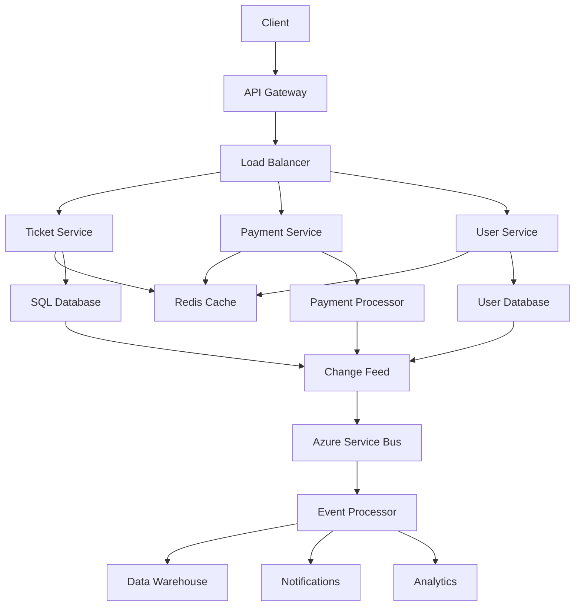
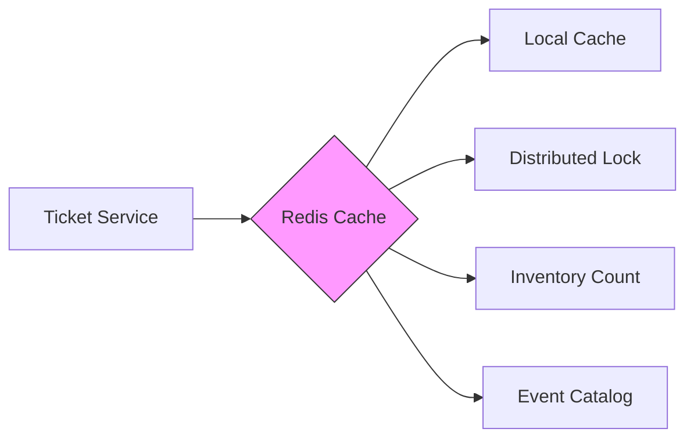
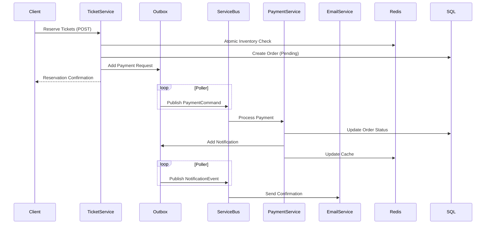

# High-Performance Ticketing System Architecture for Scalable Event Platforms

## Core System Challenges

1. **Concurrent Ticket Purchases**:
   - Race conditions when multiple users try to purchase the same limited tickets
   - Need for atomic operations to prevent overselling

2. **Distributed State Management**:
   - Tickets transition through states: Available → Reserved → Purchased → Cancelled/Refunded
   - Payments must synchronize with ticket availability
   - Venues and performers may have different cancellation policies

3. **High Volume Transaction Processing**:
   - Spike loads during popular event sales (e.g., 10,000+ TPS during presales)
   - Need to handle payment processing latency without blocking ticket inventory

4. **Data Consistency Across Services**:
   - Inventory, orders, payments, notifications must eventually converge
   - Avoid distributed transaction pitfalls

## Cloud Architecture with Outbox Pattern



### Key Components:

1. **Frontend Services**:
   - Azure Front Door for global load balancing
   - Azure API Management for request throttling and API versioning

2. **Core Services**:
   - **Ticket Service**: .NET 8 microservice with Dapr for state management
   - **Payment Service**: Isolated service with circuit breakers
   - **User Service**: Handles authentication and profiles

3. **Data Layer**:
   - Azure SQL with elastic pools for ticket inventory
   - Cosmos DB for order history (global distribution)
   - Redis Enterprise for caching with active geo-replication

## Redis Caching Strategy



### Caching Implementation:

1. **Layered Caching**:
   - **L1**: In-memory cache (5s TTL) for ultra-hot data
   - **L2**: Redis cluster with:
     - 30s TTL for inventory counts
     - 5m TTL for event details
     - 24h TTL for static venue data

2. **Cache-Aside Pattern**:
   ```csharp
   public async Task<TicketInventory> GetInventoryAsync(int eventId)
   {
       var cacheKey = $"inv:{eventId}";
       var cached = await _redis.StringGetAsync(cacheKey);
       
       if (cached.HasValue) 
           return JsonConvert.DeserializeObject<TicketInventory>(cached);
       
       var dbValue = await _db.Inventory.FindAsync(eventId);
       await _redis.StringSetAsync(cacheKey, JsonConvert.SerializeObject(dbValue), 
                                 TimeSpan.FromSeconds(30));
       
       return dbValue;
   }
   ```

3. **Inventory Management**:
   - Redis Sorted Sets for ticket tiers/pricing
   - Redis Transactions (MULTI/EXEC) for atomic operations:
   ```lua
   -- Lua script for atomic reservation
   local current = redis.call('GET', KEYS[1])
   if tonumber(current) >= tonumber(ARGV[1]) then
       redis.call('DECRBY', KEYS[1], ARGV[1])
       return 1
   end
   return 0
   ```

## Transaction Flow with Outbox Pattern



### Critical Design Decisions:

1. **Reliable Messaging**:
   - Azure Service Bus with sessions for ordered processing
   - Outbox table in SQL with idempotent consumers
   - Dead-letter queues for failed messages

2. **Concurrency Control**:
   - Optimistic concurrency for ticket reservations
   ```csharp
   var ticket = await _context.Tickets
       .FirstOrDefaultAsync(t => t.EventId == eventId);
   
   ticket.Quantity -= requestedQty;
   ticket.RowVersion++;
   
   try {
       await _context.SaveChangesAsync();
   }
   catch (DbUpdateConcurrencyException) {
       // Retry logic
   }
   ```

3. **Payment Handling**:
   - Saga pattern for long-running transactions
   - Compensating actions for failures:
   ```csharp
   public async Task Handle(PaymentFailed message)
   {
       using var scope = new TransactionScope();
       
       // Release tickets
       await _ticketService.ReleaseTickets(message.OrderId);
       
       // Update order status
       await _orderService.MarkAsFailed(message.OrderId);
       
       scope.Complete();
   }
   ```

## Scaling Strategy

| Component | Scaling Approach | Azure Service | Notes |
|-----------|------------------|--------------|-------|
| Web Tier | Stateless horizontal scaling | Azure App Service | Autoscale based on CPU/RPS |
| Ticket Service | Partitioned by event ID | Azure Kubernetes | Dapr for state management |
| Payments | Queue-based load leveling | Service Bus Premium | Isolated from ticket processing |
| Data Storage | Read replicas + sharding | Azure SQL Hyperscale | EventID-based sharding |
| Cache | Redis Enterprise Cluster | Azure Cache for Redis | Active-active geo-replication |

**Performance Considerations**:
- Pre-warm caches before major onsales
- Implement virtual waiting rooms for high-demand events
- Use Azure CDN for static assets
- Circuit breakers on payment processor integration